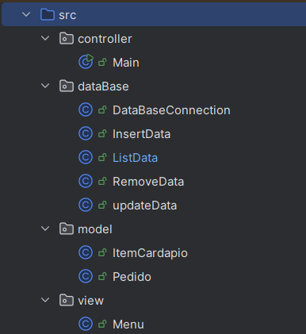

O projeto Caldinho do Chico traz um simples sistema de gerenciamento e atendimento de um restaurante que busca resolver o problema proposto com a seguinte descrição:

  **_"Atualmente os pedidos realizados por clientes no Caldinho do Chico são feitos de forma manual, gerando dificuldades na organização, alguns retrabalhos e ineficiência nos processos. O bar tem um fluxo de pedidos moderado, sendo de extrema importância a utilização de um sistema para auxiliar nesse processo."_**

ARQUITETURA UTILIZADA:

Utilizamos a arquitetura de projetos MVC (Model, view, controller) para organizar as classes do projeto

    

Segue o diagrama de casos de uso do projeto:

Segue o diagrama de classes do projeto:

